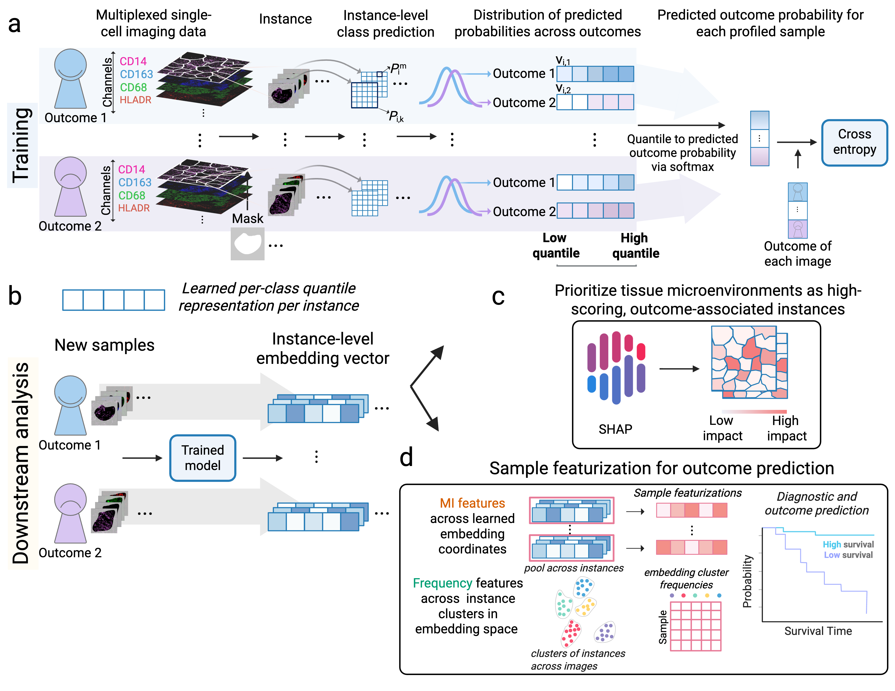

# MICRON - Microenvironment-aware Clinical Representation for Outcome Prediction via Multiple Instance Learning



{abstract}

The methods implemented in this study are based on those described in the following publication:

H. D. Couture, J. S. Marron, C. M. Perou, M. A. Troester, M. Niethammer, Multiple Instance Learning for Heterogeneous Images: Training a CNN for Histopathology, Proc. MICCAI, 2018.

## Initial Setup

Basic installation depends on python packages that can be installed using conda and pip:
```
conda install numpy scipy scikit-image scikit-learn cudatoolkit cudnn
pip install tensorflow-gpu
```

To use the learning rate range test or cyclic learning rates, install the following repository: https://github.com/psklight/keras_one_cycle_clr. Set up the submodule using the steps below:
```
git submodule init
git submodule update
```

## Dataset Example

We prepared the IMC dataset generated by Damond et al. for use with the MICRON model. We also provide the data file format required for the model input. The dataset can be accessed at the following link: https://doi.org/10.5281/zenodo.18988471

Three files need to be prepared before running the model: labels.csv, fold.csv, and sample_images.csv.

labels.csv format:
```
sample,class1
sample_1,label
sample_2,label
...
sample_N,label
```

sample_images.csv format:
```
sample,image
sample_1,image_file
sample_2,image_file
...
sample_N,image_file
```

fold.csv format:
```
sample_1,train
sample_2,train
sample_3,test
...
sample_N,val
```

## Running MICRON from the Command Line on the Diabetes Dataset

```
python3.10 run_train.py -i diabetes/sample_tiff -o MICRON-master -f 5 -m resnet50 -r 0.05 -b 5 -e 10 -c 120 --save_results save_result --test_crop 120 --mi quantile -q 16 --out_model MICRON-master
```

After running the code, we will get a pickle file.


## Citation

If you use this code, please cite:

```
@inproceedings{Couture2018_MICCAI,
 author = {Couture, Heather D. and Marron, J. S. and Perou, Charles M. and Troester, Melissa A. and Niethammer, Marc},
 booktitle = {Proc. MICCAI},
 title = {Multiple Instance Learning for Heterogeneous Images: Training a CNN for Histopathology},
 year = {2018}
}
